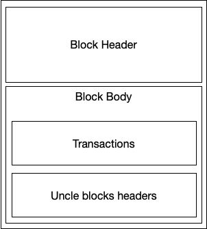

# 关于leveldb及以太坊用leveldb作为底层存储细节
 

## leveldb历史及现状
  leveldb 于2011年由google团队设计，起因是Jeff Dean和Sanjay Ghemawat希望创建一个类似于Bigtable平板电脑堆栈的系统，该系统具有最小的依赖性，适用于开放源代码，也适用于Chrome中的IndexedDB实现。现今LevelDB用作Google Chrome的IndexedDB的后端数据库，并且是Riak支持的后端之一。此外，Bitcoin Core和go-ethereum 使用LevelDB数据库存储区块链元数据。
  
## leveldb本质
**leveldb全称为level data base，可以把它理解为一个底层数据库，但它不是关系型数据库，那么啥是"关系型数据库"呢?下面是对"关系型数据库"与非关系型数据库的个人总结。**
- 关系型数据库
  - 操作方便，用户友好。 PS:像我们都可以用sql从关系型数据库中操作数据，sql是一种特定目的编程语言，用于管理关系数据库管理系统（RDBMS），或在关系流数据管理系统（RDSMS）中进行流处理。
  - 存储数据结果清晰，格式易看懂，数据都是按照行列进行存储，统一放在一个或多个表中。
  - 内存占用大。 PS:这也就是为什么许多产品的数据底层存储都是采用非关系型数据库了，当然这一其中的一个原因。
- 非关系型数据库
  - 难操作，新手体验差。 PS:当然了作为数据底层库，根本就不是给你萌新设计的。当时的设计理念为简化存储过程，节约存储空间，提高写入速度，增加可拓展性。
  - 存储结构不固定，格式有是基于文档的，Key-Value键值对的，还有基于图的等。所以说存储形态相当~的灵活。

leveldb存储结构要根据不同的产品进行特定的方式存储，数据格式为Key-Value键值对。

## 以太坊存储与leveldb

**网上关于以太坊为什么选择leveldb作为底层数据库的理由的文章较少，所以我这里主要根据以太坊的数据状态进行推测，到目前为止以太坊一个有870多万个区块被广播在链上，而且还在以每天6000多个区块在增加，区块中的交易数据占据半数以上的比重。但每个区块中的交易数量不固定，几笔、十几笔、几十笔或者是零笔。所以做个大致估计，姑且认为平均每个块有十笔交易好了。这样一来交易总量就是近9000万笔交易数据。话说回来，体量庞大的数据需要一个非关系型数据库，因为需要压缩存储空间，同时需要满足高性能的写入，每天要写入6万笔交易信息啊。而且不需要对数据库进行经常性的读取，关于leveldb的构造细节及理念就不展开了。感兴趣的朋友可以点下面的链接。** 
[LevelDB 的整体架构](https://mp.weixin.qq.com/s?__biz=MzI0MzQyMTYzOQ==&mid=2247484871&idx=1&sn=66366c97ba368cd7732855079863b9f9&chksm=e96c1d6fde1b94792f067bbd3b0c809742d2408fbf2d2f9bac3c21ee388ade1cd1000150deaf&mpshare=1&scene=1&srcid=0111cATS2EiuC750q0iPavUl&sharer_sharetime=1570678693721&sharer_shareid=d3390afaafb8cedb69afd614eff7f764&key=540c8d6698c698e010f9d95edc120c7087e6930ad5e2c541ede6a23227c9064a1847e4a20770605431f3a43a4c658efb5b6c6e5fe9d5e8d051105b544b3764320abd962f2f1c4c7f4bbdcf45d9126ccd&ascene=1&uin=MTAzNDAxNjIwMw%3D%3D&devicetype=Windows+10&version=62060833&lang=zh_CN&pass_ticket=Tfl7M18Ixl8j6OagKw1MJScYtK4wSM%2BcVh2D5zrB86EwCPqkhkg8aGvOp4bMLNkC)

**现在再来说说区块中除了交易数据还包含什么。** 

   &emsp;&emsp;-以太坊区块的抽象示意图   [图片来源](https://ethfans.org/posts/ethereum-yellow-paper-walkthrough-2-merkle-tree-world-state-transaction-block)- 
 
 **可以看到，"block header"与"block body"两者是分开存储的，为什么要这么干，我个人认为是节省内存占用。至于为什么稍后我会和大家详细讲述。继续上面所说的，"block body"中包含"transcations"和"uncle blocks headers"。[这里有一篇关于叔块的解释](https://github.com/ethereum/wiki/wiki/Design-Rationale#uncle-incentivization )** 
 **下面这张图片是更加精细的结构** 

&emsp;&emsp;&emsp;&emsp;&emsp;&emsp;&emsp;&emsp;-区块、交易、账户状态对象以及以太坊的默克尔树 [图片来源](https://ethfans.org/posts/ethereum-yellow-paper-walkthrough-2-merkle-tree-world-state-transaction-block)-
