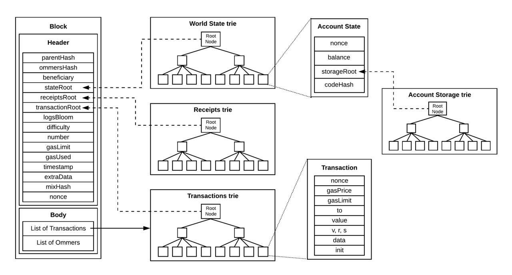
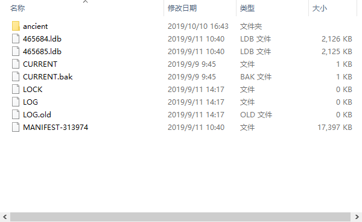
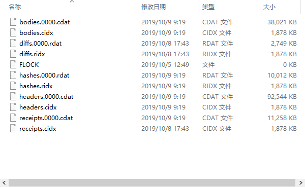

# 关于Leveldb及以太坊用Leveldb作为底层存储细节
 

## Leveldb历史及现状
  Leveldb 于2011年由google团队设计，起因是Jeff Dean和Sanjay Ghemawat希望创建一个类似于Bigtable平板电脑堆栈的系统，该系统具有最小的依赖性，适用于开放源代码，也适用于Chrome中的IndexedDB实现。现今Leveldb用作Google Chrome的IndexedDB的后端数据库，并且是Riak支持的后端之一。此外，Bitcoin Core和go-ethereum 使用Leveldb数据库存储区块链元数据。
  
## Leveldb本质
**Leveldb全称为level data base，可以把它理解为一个底层数据库，但它不是关系型数据库，那么啥是"关系型数据库"呢?下面是对"关系型数据库"与非关系型数据库的个人总结。**
- 关系型数据库
  - 操作方便，用户友好。 PS:像我们都可以用sql从关系型数据库中操作数据，sql是一种特定目的编程语言，用于管理关系数据库管理系统（RDBMS），或在关系流数据管理系统（RDSMS）中进行流处理。
  - 存储数据结果清晰，格式易看懂，数据都是按照行列进行存储，统一放在一个或多个表中。
  - 内存占用大。 PS:这也就是为什么许多产品的数据底层存储都是采用非关系型数据库了，当然这一其中的一个原因。
- 非关系型数据库
  - 难操作，新手体验差。 PS:当然了作为数据底层库，根本就不是给你萌新设计的。当时的设计理念为简化存储过程，节约存储空间，提高写入速度，增加可拓展性。
  - 存储结构不固定，格式有是基于文档的，Key-Value键值对的，还有基于图的等。所以说存储形态相当~的灵活。

Leveldb存储结构要根据不同的产品进行特定的方式存储，数据格式为Key-Value键值对。
  
## 以太坊存储与Leveldb

**网上关于以太坊为什么选择Leveldb作为底层数据库的理由的文章较少，所以我这里主要根据以太坊的数据状态进行推测，到目前为止以太坊一个有870多万个区块被广播在链上，而且还在以每天6000多个区块在增加，区块中的交易数据占据半数以上的比重。但每个区块中的交易数量不固定，几笔、十几笔、几十笔或者是零笔。所以做个大致估计，姑且认为平均每个块有十笔交易好了。这样一来交易总量就是近9000万笔交易数据。话说回来，体量庞大的数据需要一个非关系型数据库，因为需要压缩存储空间，同时需要满足高性能的写入，每天要写入6万笔交易信息啊。而且不需要对数据库进行经常性的读取，关于Leveldb的构造细节及理念就不展开了。感兴趣的朋友可以点下面的链接。** 
[Leveldb 的整体架构](https://mp.weixin.qq.com/s?__biz=MzI0MzQyMTYzOQ==&mid=2247484871&idx=1&sn=66366c97ba368cd7732855079863b9f9&chksm=e96c1d6fde1b94792f067bbd3b0c809742d2408fbf2d2f9bac3c21ee388ade1cd1000150deaf&mpshare=1&scene=1&srcid=0111cATS2EiuC750q0iPavUl&sharer_sharetime=1570678693721&sharer_shareid=d3390afaafb8cedb69afd614eff7f764&key=540c8d6698c698e010f9d95edc120c7087e6930ad5e2c541ede6a23227c9064a1847e4a20770605431f3a43a4c658efb5b6c6e5fe9d5e8d051105b544b3764320abd962f2f1c4c7f4bbdcf45d9126ccd&ascene=1&uin=MTAzNDAxNjIwMw%3D%3D&devicetype=Windows+10&version=62060833&lang=zh_CN&pass_ticket=Tfl7M18Ixl8j6OagKw1MJScYtK4wSM%2BcVh2D5zrB86EwCPqkhkg8aGvOp4bMLNkC)

**现在再来说说区块中除了交易数据还包含什么。** 

   &emsp;&emsp;-以太坊区块的抽象示意图   [图片来源](https://ethfans.org/posts/ethereum-yellow-paper-walkthrough-2-merkle-tree-world-state-transaction-block)- 
 
 **可以看到，"block header"与"block body"两者是分开存储的，为什么要这么干，我个人认为是节省内存占用。至于为什么稍后我会和大家详细讲述。继续上面所说的，"block body"中包含"transcations"和"uncle blocks headers"。[这里有一篇关于叔块的解释](https://github.com/ethereum/wiki/wiki/Design-Rationale#uncle-incentivization )** 
 **下面这张图片是更加精细的结构** 

&emsp;&emsp;&emsp;&emsp;&emsp;&emsp;&emsp;&emsp;&emsp;&emsp;&emsp;&emsp;&emsp;&emsp;-区块、交易、账户状态对象以及以太坊的默克尔树 [图片来源](https://ethfans.org/posts/ethereum-yellow-paper-walkthrough-2-merkle-tree-world-state-transaction-block)-  
[什么是默克尔树](https://zhuanlan.zhihu.com/p/39271872 )

&emsp;&emsp;&emsp;&emsp;&emsp;&emsp;&emsp;&emsp;&emsp;&emsp;&emsp;&emsp;&emsp;&emsp;&emsp;&emsp;&emsp;&emsp;&emsp;&emsp;&emsp;&emsp; **Block Header 变量含义** 

|**No** |**变量** |**数据类型** |**字段描述** |
| --------   | -----:   | :----: | :----: |
|1 |parentHash |byte |前一个区块的区块头哈希值 |
|2 |sha3Uncles |byte |叔块头以及部分区块体的哈希值 |
|3 |miner |byte |主成成分2 |
|4 |stateRoot |byte |世界状态树的根节点哈希值（在所有交易被执行后） |
|5 |transactionsRoot |byte |交易树根节点的哈希值。这棵树包含了区块体的所有交易。 |
|6 |receiptsRoot |byte |每当交易执行时，以太坊都会生成对应结果的交易收据。此处就是这个交易收据树的根节点哈希。 |
|7 |difficulty |uint64 |这是当前区块挖矿难度的度量值 |
|8 |number |uint64 |前序区块的总数。也就是区块高度 |
|9 |gasLimit |uint64 |gas limit 标示了该区块所记录的所有交易可以使用的 gas 总量 |
|10 |gasUsed |uint64 |区块中各条交易所实际消耗的 gas 总量 |
|11 |timestamp |uint64 |区块创建时的 Unix 时间戳。该值为1970年至该区块被打包时所经过的秒数 |
|12 |extraData |byte |能输入任何东西的不定长字节数组。当矿工创建区块时，可以在这个区域添加任何东西 |
|13 |mixHash |byte |用于验证一个区块是否被真正记录到链上的哈希值 |
|14 |nonce |uint64 |和 mixHash 一样，用于验证区块是否被真正记录到链上的值 |

  
&emsp;&emsp;&emsp;&emsp;&emsp;&emsp;&emsp;&emsp;&emsp;&emsp;&emsp;&emsp;&emsp;&emsp;&emsp;&emsp;&emsp;&emsp; **Block Body 变量含义** 

|**No** |**变量** |**数据类型** |**字段描述** |
| --------   | -----:   | :----: | :----: |
|1 |hash |byte |交易哈希值 |
|2 |size |uint64 |交易数据占用内存值 |
|3 |from |byte |交易发起方 |
|4 |nonce |uint64 |此账户发出的交易序号数 |
|5 |gasPrice |uint64 |执行此交易、进行计算时为每单位 gas 所支付的费用（以 Wei 计量） |
|6 |gas |uint64 |执行此交易时可以使用的最大 gas 数量 |
|7 |to |byte |交易接收方 |
|8 |value |uint64 |交易总额 |
|9 |input |byte |发送消息调用时附带的输入数据（可以理解为调用智能合约时执行的程序） |
|10 |v |byte |在交易的密码学签名中用到的值，可以用于确定交易的发送方 |
|11 |r |byte |在交易的密码学签名中用到的值，可以用于确定交易的发送方 |
|12 |s |byte |在交易的密码学签名中用到的值，可以用于确定交易的发送方 |

  

**以上就是"block header"与"block body"的全部数据变量，同步数据geth版本为1.9.2。**  

## 以太坊数据文件描述
 

**简单介绍了以太坊存储形式及包含的变量，下面说说我们同步下来的Leveldb数据是什么样子，以及Leveldb的文件含义。**  

 &emsp;&emsp;&emsp;&emsp;&emsp;&emsp;&emsp;&emsp;&emsp;&emsp;&emsp;&emsp;&emsp;&emsp;-以太坊Leveldb本地存储形态-
  
**下面对每个文件进行解释**
 
- CURRENT是一个指针，指向最后一个数据库文件（这种顺序读写最后一个的特性和区块链的非常契合）
- LOCK是锁定了当前数据库的标志文件
- LOG是全局日志，供维护人员参阅
- MANIFEST-[0-9]+ // 描述文件。只有CURRENT指向的当前文件才是有效的
- db/[0-9]+.ldb // dbtable文件,后台进程会周期性将陈旧的内容写入ldb文件
 

[关于文件描述参考文章](https://uzshare.com/view/2025)

 

 &emsp;&emsp;&emsp;&emsp;&emsp;&emsp;&emsp;&emsp;&emsp;&emsp;-以太坊Leveldb本地存储形态ancient文件夹-
  
**下面还是对部分文件进行解释**
 
- headers中存储的是每个区块的header
- bodys中存储的是每个区块的body
- receipts中存储的是每个区块交易树的计算因子（这里值得一提的是当geth更新到1.9.x之后，更改了部分数据结构的scheme，例如以前的receipt是存放在header中，现在可以在读取历史数据之后重新计算出来，这样一来省下了一大块的内存占用。）
- FLOCK是锁定了当前数据库的标志文件

 
**关于介绍以太坊数据文件就到这里了。**
